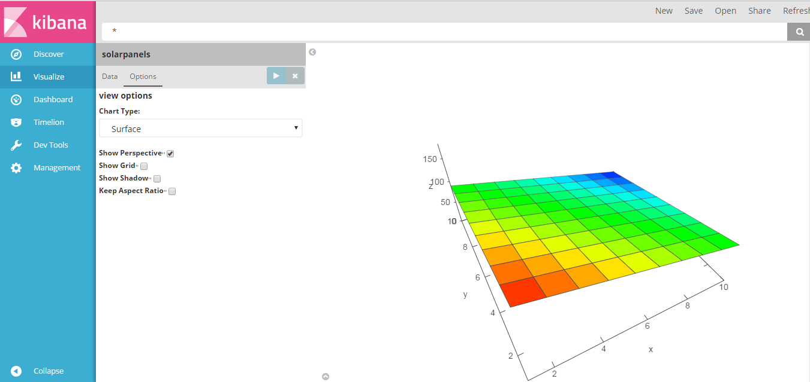
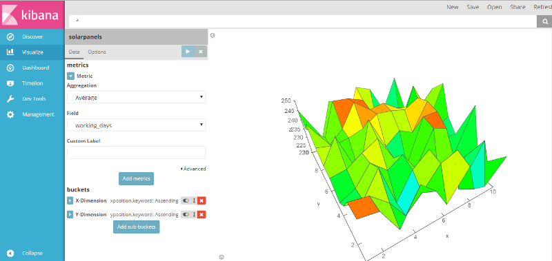
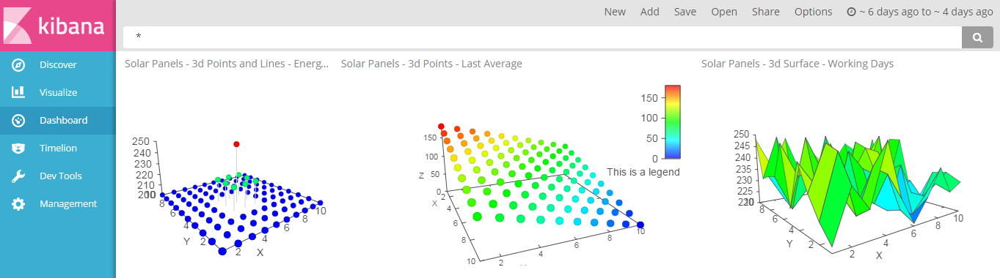

# area3d_vis
3D Graph Visualization for Kibana 5!

This is the first version of a 3D Graph Visualization plugin for Kibana 5.0.

The idea behind this visualization is to add a new interesting Graph feature, to the current Kibana series of 
charts and metrics, to show 3D data.

Charts are rendered using the awesome js component called Vis.js, developed by @almende (https://github.com/almende/vis).

Here are some screenshots of how it's coming out. I hope you like it!

The visualization needs one Metric (Count, Avg, Sum, Max, Min) which will be the Z value, 
and two Aggregators (X, Y).

In this example I'm plotting the performance indicators of an imaginary, solar panel array.

You need to install first Vis.js !

(npm i vis)

